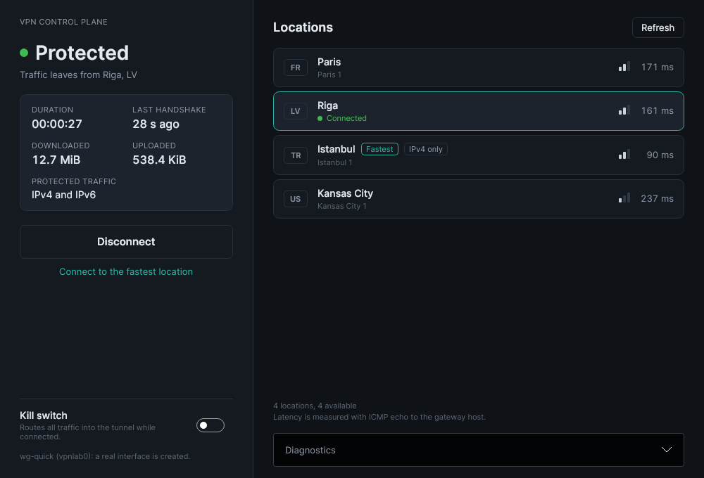
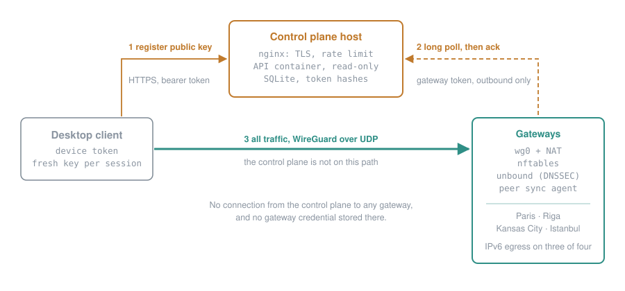
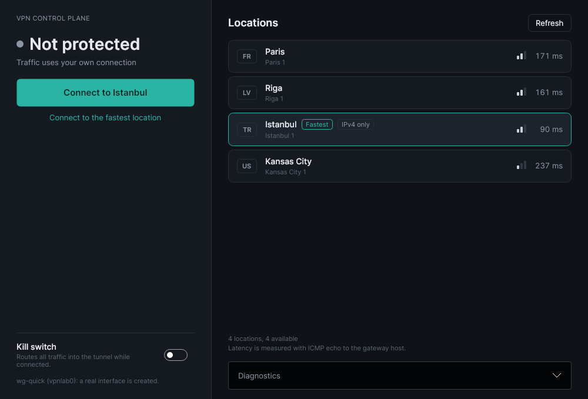
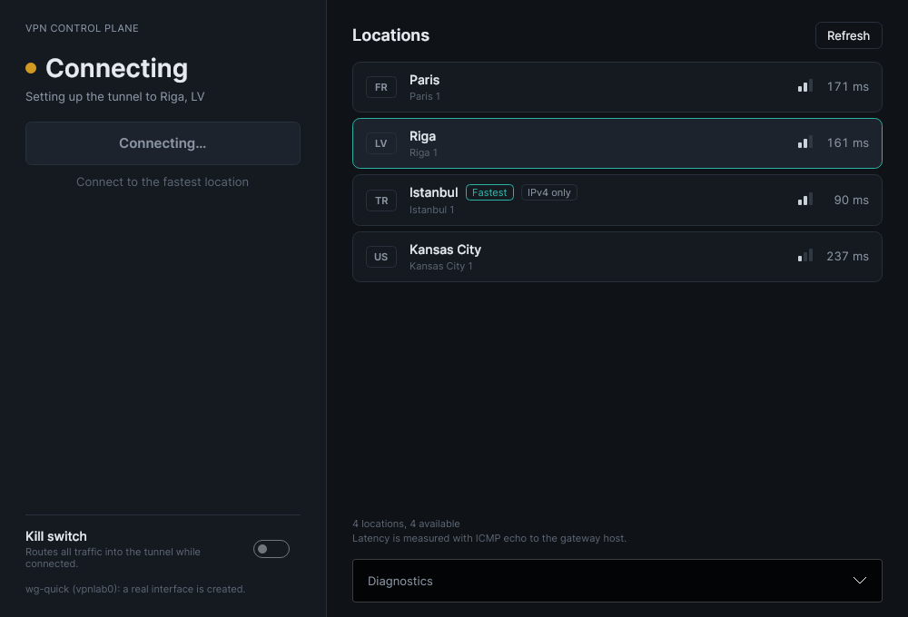
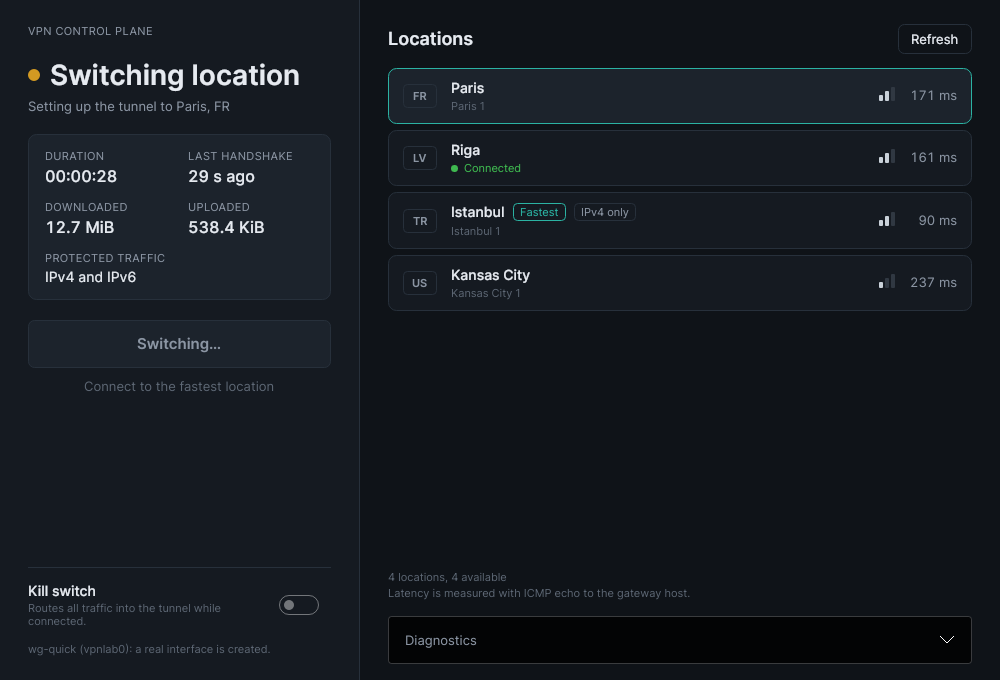
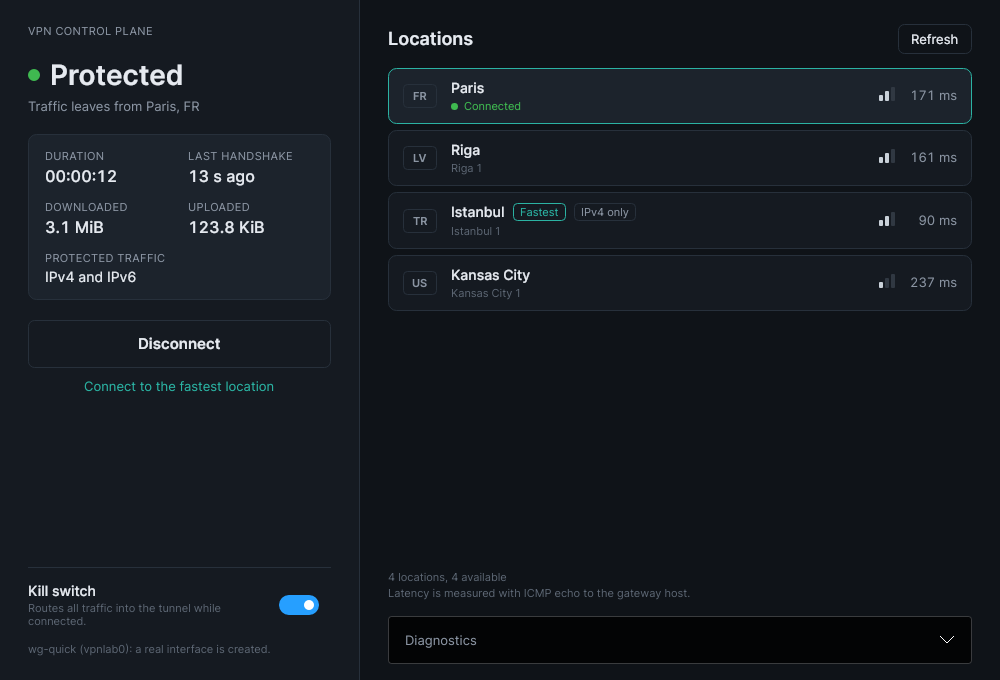
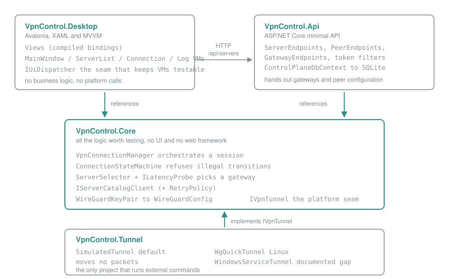
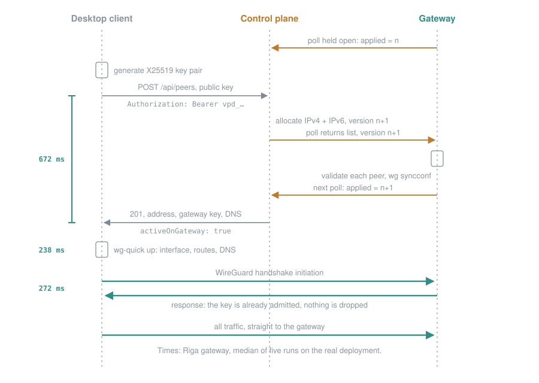
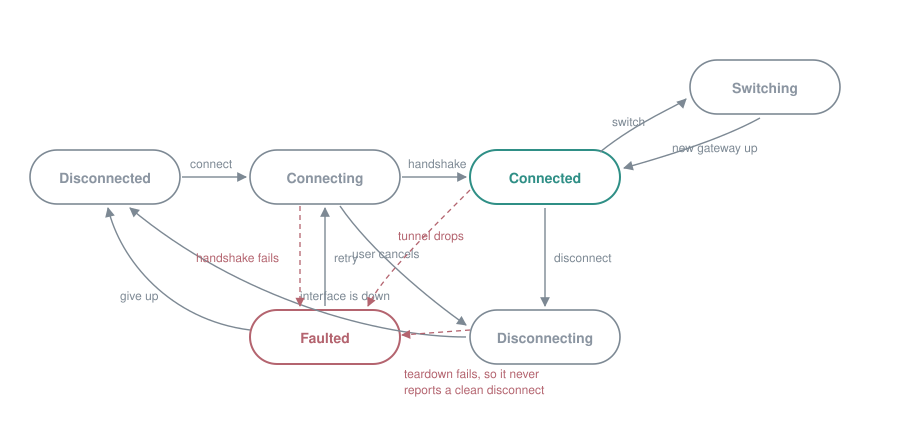

# VPN Control Plane

[](https://github.com/hakangoksu/vpn-control-plane/actions/workflows/ci.yml)

A WireGuard VPN built end to end: a desktop client, the control plane that decides which
devices may connect where, and the automation that turns plain Linux servers into gateways.
C# on .NET 10, running against four real gateways in Paris, Riga, Kansas City and Istanbul.



## Try it

**Without any servers.** Demo mode simulates the tunnel and uses fictional locations, so it
runs anywhere:

```bash
./client.sh --demo                              # with Docker
dotnet run --project src/VpnControl.Desktop     # or with the .NET 10 SDK
```

**On your own servers.** You need one or more Linux servers (Debian 12 or 13, public IPv4) and a
domain you can add DNS records to.

```bash
./setup.sh      # asks a few questions, then sets everything up
./client.sh     # opens the client, connected to your own gateways
```

`setup.sh` asks for your domain and servers, generates every key and password itself, tells
you exactly which DNS records to add and waits until they resolve, hardens and configures each
server, deploys the control plane with TLS, enrolls this machine as a device, and finishes by
connecting through every gateway to check it works. Running it again changes nothing, or sets
up a server you have added. [`deploy/README.md`](deploy/README.md) explains every step.

`client.sh` runs the client in a container with its own network namespace, so a real tunnel
needs no root and no .NET SDK on your machine, and leaves your machine's routing alone.

## What it does

- **Connect in one to two seconds.** Pick a location, or let it choose the fastest; the client
  measures every gateway first.
- **Switch without disconnecting by hand.** One button moves an open session to another
  location.
- **No leaks around the tunnel.** IPv4 and IPv6 both go through it, and DNS goes to a
  resolver on the gateway. Where a gateway has no IPv6, IPv6 is refused rather than sent
  outside.
- **Access per device.** Every device has its own token and can be revoked on its own; the
  gateways drop it within ten seconds.
- **Gateways that protect other users.** Users cannot reach each other, the provider's
  internal network, or send mail.

**It is a portfolio project, not a VPN service.** There is no Windows client, the kill switch
is routing rather than a firewall rule, and the control plane runs as one instance.
[Limitations](#limitations-and-honesty) lists what is missing and why.

## How it works

Four gateways: Paris, Riga, Kansas City and Istanbul. Three are fresh virtual servers this
project owns entirely; the fourth is an existing server that also runs a mail server, websites
and Docker, and hosts the control plane. [`deploy/README.md`](deploy/README.md) is the complete
guide, written so somebody else can fill in their own hosts and run it.



- The control plane is not on the data path. It hands out addresses and keys; traffic goes
  straight from the client to the chosen gateway.
- Gateways pull their peer list with a long poll and their own token. The API holds no credential
  for any gateway and never connects to one, and the agent on each gateway refuses any peer whose
  addresses are not single hosts in its own tunnel range.
- A registration answers only after the gateway confirms it has admitted the key, so the client's
  first handshake is not dropped and retried five seconds later.
- Every client routes IPv4 and IPv6 into the tunnel. The gateway without IPv6 refuses tunnel IPv6
  with an immediate ICMPv6 error rather than letting it leak around the tunnel.
- Gateways refuse client-to-client traffic, private and link-local destinations including the
  cloud metadata service, and outbound SMTP. DNS goes to a validating resolver on the gateway.

The connect sequence, the state machine and the code are described [further down](#architecture).

## Measured

Taken on 30 September 2026 with [`tools/e2e`](tools/e2e/client.sh), a WireGuard client in a
container, five runs that each connect to one gateway and then switch through the other three.
Medians of five; every run also checked that IPv4, IPv6 and DNS left through the right gateway
and that the metadata service and SMTP were unreachable, and all of them did.

| Gateway | ICMP round trip, direct | Round trip through the tunnel | Register (incl. gateway confirmation) | Tunnel up to first handshake | Connect, total | Switch from the previous gateway |
|---|---|---|---|---|---|---|
| Istanbul | 86 ms | 87 ms | 468 ms | 113 ms | 827 ms | 1402 ms |
| Riga | 157 ms | 158 ms | 672 ms | 272 ms | 1204 ms | first in each run |
| Paris | 170 ms | 168 ms | 738 ms | 296 ms | 1262 ms | 1799 ms |
| Kansas City | 238 ms | 238 ms | 930 ms | 437 ms | 1604 ms | 2158 ms |

How to read it, and what it is not:

- The machine that took these routes all its own traffic through another WireGuard tunnel that
  leaves from Istanbul, so every figure includes that hop and Istanbul looks closest. They show
  what the design does, not what a user elsewhere would see.
- "Register" is the whole HTTPS request, including a fresh TLS connection to the control plane
  and the wait for the gateway's acknowledgement.
- Before the acknowledgement existed, the same measurement gave a first handshake of five to six
  seconds, because the handshake often arrived before the gateway had admitted the key.
- A tunnel round trip equal to the direct one says WireGuard adds nothing measurable at this
  scale, not that it is free. Nothing here was measured under load.
- On the gateway without IPv6, an IPv6 request failed in under 300 ms, which is the
  administratively prohibited reply doing its job.

Run it against your own deployment:

```bash
docker build -t vpn-e2e tools/e2e
docker run --rm --cap-add NET_ADMIN \
  --sysctl net.ipv4.conf.all.src_valid_mark=1 --sysctl net.ipv6.conf.all.disable_ipv6=0 \
  -e API=https://vpn.example.org -e TOKEN=vpd_... \
  vpn-e2e gw1 gw2 gw3
```

## Screenshots

The real client against the real deployment. They were taken on a virtual display inside a
container with [`tools/screenshots`](tools/screenshots/shoot.sh), so nothing from the desktop
around the window is in them, and none is edited.

| Not protected | Connecting | Switching location | Kill switch on |
|---|---|---|---|
|  |  |  |  |

## Why it exists

To practise the shape of a real VPN client end to end: a desktop UI, a backend that hands out
tunnel parameters, and a platform layer that does the privileged work, with a clear seam
between them. The interesting parts of such a client are not the cryptography, which WireGuard
already settled, but the things around it: a connection state machine that stays honest when
the user cancels mid-handshake, a gateway choice that accounts for load as well as latency, a
teardown path that does not leave an interface behind, and a UI that never claims a tunnel is
up before it is.

## Building and running from source

For working on the code. You need the .NET 10 SDK and nothing else: no database service, no
WireGuard installation, no root.

```bash
# Build everything.
dotnet build

# Run the tests. The real counts are printed by this command; no figure from it is
# reproduced in this file.
dotnet test

# Run the API. In the Development environment it creates a SQLite file, seeds the
# fictional gateways and listens on http://localhost:5080, with Swagger at /swagger.
dotnet run --project src/VpnControl.Api

# Run the desktop client. Standalone by default: it answers its own catalog requests from
# memory and simulates the tunnel, so it needs neither the API above nor privileges.
dotnet run --project src/VpnControl.Desktop
```

Every API route except `/health` wants a device token. Enroll one against the local
database; the token is printed once and only its hash is stored:

```bash
dotnet run --project src/VpnControl.Api -- admin device add laptop
```

To point the client at the running API instead of its in-memory catalog:

```bash
dotnet run --project src/VpnControl.Desktop -- \
  --Desktop:UseControlPlaneApi=true --ServerCatalog:DeviceToken=vpd_...
```

A few requests against the API by hand:

```bash
TOKEN=vpd_...
curl http://localhost:5080/health
curl -H "Authorization: Bearer $TOKEN" http://localhost:5080/api/servers
curl -H "Authorization: Bearer $TOKEN" 'http://localhost:5080/api/servers?country=LT'

# The public key has to be a real 32 byte base64 value: `wg genkey | wg pubkey`.
curl -X POST http://localhost:5080/api/peers \
  -H "Authorization: Bearer $TOKEN" -H 'Content-Type: application/json' \
  -d '{"serverId":"lt-vln-01","publicKey":"<32 byte base64 key>"}'
```

## Architecture



The dependency direction is the point. `Core` references no UI framework, no web framework and
no platform tooling. `Desktop` and `Api` both reference `Core`, and neither references the
other. `Tunnel` sits below `Core`'s `IVpnTunnel` interface and is the only project that runs
external commands.

## The connect sequence



Inside the client, `MainWindowViewModel` calls `VpnConnectionManager.ConnectAsync`, which moves
the state machine to `Connecting`, generates the key pair, registers it through the catalog
client, builds a `WireGuardConfig` from the answer and hands it to the tunnel backend. The
window turns green only when the backend reports the interface up, and from then on the
counters are polled once a second.

The failure path matters as much as the happy one. If `UpAsync` throws after the peer was
registered, the manager releases that registration before it reports the fault, so a failed
attempt does not leave an address reserved for a tunnel that never existed. "Connect to
fastest" adds a `RefreshAsync` in front of this sequence: fetch the catalog, probe every
gateway with a bounded fan-out, rank them, then connect to the winner.

## The connection state machine

`ConnectionStateMachine` holds the state and refuses any change the table does not allow. The
table is a public static property, so the documentation, the tests and the implementation all
read the same rules.



| From | To | Why it is allowed |
|---|---|---|
| `Disconnected` | `Connecting` | The only thing there is to do when idle. |
| `Connecting` | `Connected` | The handshake succeeded. |
| `Connecting` | `Disconnecting` | The user cancelled mid-attempt, so what was built has to come down. |
| `Connecting` | `Faulted` | The registration or the interface failed. |
| `Connected` | `Switching` | Moving an established session to another gateway. |
| `Connected` | `Disconnecting` | The user asked to stop. |
| `Connected` | `Faulted` | The tunnel dropped. |
| `Switching` | `Connected` | Landed on the new gateway. |
| `Switching` | `Disconnecting` | The switch was abandoned. |
| `Switching` | `Faulted` | The switch failed with no session left. |
| `Disconnecting` | `Disconnected` | Teardown completed. |
| `Disconnecting` | `Faulted` | The interface would not come down, which is the leak a kill switch exists to prevent. |
| `Faulted` | `Connecting` | Retry directly. |
| `Faulted` | `Disconnecting` | Clean up first. |
| `Faulted` | `Disconnected` | Acknowledge and reset. |

Everything not in that table is rejected. `TransitionTo` throws
`InvalidStateTransitionException`; `TryTransitionTo` returns `false` and is used on teardown
paths, where the session may already be where it is being asked to go and an exception would be
noise. `Disconnected -> Connected` is not allowed, so nothing can report a tunnel as up without
passing through `Connecting`. `Connected -> Disconnected` is not allowed either, so a session
cannot end without teardown running.

## Code walkthrough

This section covers every project and every type in it: what it is, what it does, and why it is
there. It is written for someone who has not seen the code before.

### VpnControl.Core

The portable library. No UI framework, no web framework, no external processes, and everything
in it is covered by unit tests. This is where the logic lives.

#### Servers: the catalog

| Type | What it is | What it does and why |
|---|---|---|
| `VpnServer` | A record describing one gateway | Id, name, city, country, endpoint host and port, the gateway's base64 X25519 public key, reported `LoadPercent`, `IsEnabled`, and `Ipv6Egress`, which says whether IPv6 leaves the gateway or is refused there. Computed `Endpoint` (`host:port`) and `Location` (`City, CC`). A record so value equality is free and `with` produces a modified copy instead of mutating one another thread may be reading. It doubles as the wire model the API returns, so the contract cannot drift between the two sides. |
| `ServerCatalog` | An immutable snapshot of the gateways known at one moment | Built from a sequence plus a `RetrievedAt` stamp, rejecting duplicate identifiers. Exposes `Servers` sorted by country, city, id; `Find(id)`, `Enabled()`, `InCountry(country)`, `Countries()`, `Count` and a static `Empty`. It is a snapshot rather than a live collection because a list that changes underneath a running selection pass produces bugs that only appear under load. |
| `IServerCatalogClient` | The client's view of the control plane | Four methods: `GetServersAsync(country, city, ct)`, `GetServerAsync(id, ct)`, `RegisterPeerAsync(request, ct)`, `UnregisterPeerAsync(peerId, ct)`. This is the seam that keeps everything above it testable: the connection manager depends on this, never on `HttpClient`. |
| `HttpServerCatalogClient` | The HTTP implementation | A typed client, so the host owns the `HttpClient` and its handler lifetime. Retries through `RetryPolicy` with a transient-failure rule that knows the catalog's semantics: a 404 for a gateway is an answer, not a failure, so it is mapped to `null` and never retried, while a 5xx, a 408, a 429, a connection failure and a timeout are. A private generic `SendAsync` builds each request from a factory, because an `HttpRequestMessage` cannot be sent twice and a retry needs a fresh one, and turns every transport or parsing failure into one `ServerCatalogException`. The device token is attached to each request as a bearer credential rather than set on the shared client's default headers, where it would travel with requests it was never meant for. |
| `InMemoryServerCatalogClient` | The same interface, answered from memory | The reason that interface pays for itself: the desktop app points at this when no backend is running, so the whole application can be launched and clicked through on a machine with nothing installed. It assigns addresses and issues peer ids exactly as the API does, so the code above cannot tell the difference. Thread safe, because the UI polls it from a background task. `RegisteredPeerCount` is exposed for assertions. |
| `DemoCatalog` | The fictional gateway list | `CreateServers()` returns nine gateways across LT, PL, DE, SE, NL and US, one of them disabled so the excluded path is visible. Every host is in the `.invalid` top level domain, which RFC 2606 reserves precisely so an example name can never resolve to somebody's real machine. Keys are generated per call and the private halves discarded immediately, so nothing in the repository resembles a credential and nothing here could complete a handshake. |
| `PeerRegistrationRequest` | What a client sends to claim a slot | Gateway id, the client's base64 public key, an optional device name. Only the public half ever leaves the client, which is the whole point of the exchange. |
| `PeerConfiguration` | What the server side decides on the client's behalf | Peer id, gateway id, assigned IPv4 and IPv6 addresses in CIDR form, whether the gateway confirmed the key before the answer was sent, the gateway's public key, the endpoint, the prefixes to route into the tunnel, DNS resolvers and an optional keepalive interval. Maps almost one to one onto a WireGuard configuration file, minus the private key, which never appears here. |
| `ServerCatalogOptions` | Settings for the HTTP client | Base address, device token, per-attempt timeout, max attempts, retry base delay. Bound from the `ServerCatalog` configuration section and validated with data annotations. |
| `ServerCatalogException` | The one failure type every catalog client reports | Carries an optional `StatusCode`. Without it, callers would have to catch `HttpRequestException`, `JsonException` and `TaskCanceledException` separately, leaking the transport into code with no business knowing about it. |

#### Latency: measuring and choosing

| Type | What it is | What it does and why |
|---|---|---|
| `ILatencyProbe` | Strategy for measuring how far away a gateway is | `Name` and `ProbeAsync(server, ct)`. An interface because every honest way of measuring a WireGuard gateway has a drawback: a TCP connect measures a different port, ICMP needs privileges on some platforms, and a real WireGuard handshake needs a key the client has not been issued yet. The seam lets the deployment pick its trade-off and lets the tests pick certainty. |
| `LatencyMeasurement` | The outcome of one probe | `Server`, `RoundTrip` or `Error`, with `IsReachable`, `IsHealthy` (reachable **and** enabled by the operator) and `RoundTripMilliseconds`. Built through `Success(...)` and `Failure(...)`. A failed probe is a value rather than an exception, because the caller probes every gateway and expects some to be down; throwing would lose the difference between "this one is down" and "the whole run failed". |
| `IcmpLatencyProbe` | The default real probe | ICMP echo to the gateway host. Without root, .NET runs the system's `ping` utility, which uses an unprivileged ICMP socket, so no elevated rights are needed; where `ping` is missing the probe reports a failed measurement rather than throwing. Resolves the name first and keeps that out of the figure, and tries IPv4 before IPv6 so a network without IPv6 does not spend the budget on an address it cannot reach. The default because it touches no service on the gateway: timing a TCP handshake to SSH, the one TCP port these gateways expose, ran into the SSH connection limit. |
| `TcpConnectLatencyProbe` | The TCP alternative | Times a TCP handshake to a configurable port, for networks that filter ICMP. Same resolution rules as the ICMP probe; a refused connection counts as an answer, since a reset comes back after one round trip like a SYN-ACK. Uses `Stopwatch.GetTimestamp` rather than two wall-clock reads, because a clock adjustment between two reads can produce a negative interval. It measures the path to the host, not the WireGuard service, and nothing in this project presents it as the tunnel's latency. |
| `DeterministicLatencyProbe` | The simulated probe | Derives a stable latency per gateway from an FNV-1a hash of its id, with configurable minimum and spread, and accepts per-gateway overrides where a `null` means "treat as unreachable". FNV rather than `string.GetHashCode`, which is randomised per process and would give different numbers every launch. `DeriveLatency(id)` is public so a test can predict the value. Nothing it returns was measured, and `Name` says so. |
| `LatencyProbeExtensions.ProbeAllAsync` | Runs a probe across a whole catalog | `Parallel.ForEachAsync` with a concurrency cap, writing into a pre-sized array by index so no synchronisation is needed, then orders reachable first and fastest first. The cap exists because a hundred simultaneous probes compete for the same uplink and make every measurement look worse than it is. |
| `ServerSelectionOptions` | What "best" means | `LoadWeight` (default 1.0), `MaxLoadPercent` (default 95), optional `MaxLatency`. Settings rather than constants because the right answer differs by deployment: a gaming profile wants the lowest latency almost regardless of load, a streaming profile would rather avoid a busy gateway. |
| `ServerSelector` | Turns measurements into a ranking | `Select(measurements)` returns the ranked candidates and the rejects. `Score(roundTrip, loadPercent)` is `latency_ms * (1 + LoadWeight * load/100)`: multiplying rather than adding keeps the score in milliseconds, so it stays readable, and makes the penalty proportional. `SelectBest` is the one-line convenience. Ties are broken by load, then latency, then id, so the same input always gives the same output. A pure function of its input: no network, no clock, no logging, which is what makes ties, saturated gateways and an unreachable region cheap to test. |
| `ServerRanking` | One gateway's place in a ranking | Gateway, round trip, and the score that put it there. The score is carried so the UI and the logs can show why one gateway beat another instead of presenting the choice as a black box. |
| `ExcludedServer` | A gateway that was not considered, and why | Plain text reason, suitable for a tooltip or a log line. |
| `ServerSelectionResult` | The full outcome of a selection pass | `Ranked`, `Excluded`, `Best`, `HasCandidate`. Returning the rejects rather than dropping them is the difference between "no server available" and a support conversation: when selection finds nothing, the reasons are the answer. |

#### Crypto: keys and configuration

| Type | What it is | What it does and why |
|---|---|---|
| `WireGuardKeyPair` | An X25519 key pair | `Generate()` from the platform random source, `FromPrivateKey(base64)` to rebuild one, `IsValidKey(base64)` to check the shape of a key arriving over the wire, `PublicKeyBase64`, `PrivateKeyBase64` and `KeyLength`. Disposable, and `Dispose` overwrites the private key buffer: dropping the reference would leave the bytes in memory until the collector happened to reuse the page. Reading the private key after disposal throws. The X25519 primitive comes from BouncyCastle, because the .NET base class library has none and hand-rolling curve arithmetic would be the wrong kind of ambitious. |
| `WireGuardConfig` | A complete tunnel configuration, and the code that renders it | `Create(peer, keys, killSwitch, mtu)` validates both keys, the address, the endpoint and the prefixes, and substitutes `FullTunnelPrefixes` (`0.0.0.0/0`, `::/0`) when the kill switch is on. `ToConfigText()` renders the `[Interface]` and `[Peer]` sections that `wg-quick` and the WireGuard clients read, with `\n` line endings fixed rather than taken from the environment. `ToRedactedConfigText()` renders the same thing with the private key replaced, and exists so the safe version is the easy one to reach for when somebody adds a "show me the config" button. `DefaultMtu` is 1420, which leaves room inside a 1500 byte path for the outer IP, UDP and WireGuard headers. |

#### Http

| Type | What it is | What it does and why |
|---|---|---|
| `RetryPolicy` | Bounded retries with exponential backoff | `ExecuteAsync(operation, shouldRetry, ct)` runs an operation that receives its one-based attempt number, retrying while the predicate accepts the exception and attempts remain. `DelayForAttempt(n)` doubles the base delay per attempt and clamps to `MaxDelay`, multiplying ticks rather than milliseconds so sub-millisecond precision survives. Cancellation is never retried: the caller asked to stop. The delay function is injected, which is how the tests assert the backoff without waiting for it. A real service would take this from Polly; it is written out because the mechanics are the subject. |

#### Tunneling: the platform seam

| Type | What it is | What it does and why |
|---|---|---|
| `IVpnTunnel` | The one thing every platform has to provide | `Name`, `IsSimulated`, `State`, a `StateChanged` event, `UpAsync(config, ct)`, `DownAsync(ct)`, `GetStatisticsAsync(ct)`, and `IAsyncDisposable`. Everything above this line is portable C# covered by tests; everything below is `wg-quick`, a privileged Windows service, or a simulation. Keeping it to three methods and an event makes porting a bounded job rather than an audit of the whole codebase. `IsSimulated` is on the interface rather than inferred from the type, so the UI can label a simulated session without knowing which backends exist. |
| `TunnelState` | `Down`, `Up`, `Faulted` | Deliberately smaller than the application's `ConnectionState`. A backend knows whether an interface exists; it does not know whether the application is switching gateways or waiting on the control plane. Giving it the larger vocabulary would mean two places deciding what "connecting" means. |
| `TunnelStatistics` | Counters read back from a live tunnel | Bytes received and sent, the last handshake time, the endpoint in use, a static `Empty`, and `IsPeerAlive(now, maxAge)` defaulting to three minutes. The handshake age is the honest answer to "am I really connected": WireGuard has no session to tear down, so a tunnel whose last handshake is minutes old is one whose peer has gone away, even though the interface still exists. |
| `TunnelStateChangedEventArgs` | Previous state, current state, optional detail | |
| `TunnelException` | A backend failure | Carries `IsPrivilegeProblem` and an optional `ExitCode`, so a caller can tell "you are not root" from "the tool failed". |

#### Connection: orchestration

| Type | What it is | What it does and why |
|---|---|---|
| `ConnectionState` | `Disconnected`, `Connecting`, `Connected`, `Switching`, `Disconnecting`, `Faulted` | A boolean for "connected" runs out of room immediately: the user clicks disconnect while the handshake is in flight, or switches gateway while connected, and the interface has no honest way to describe what is happening. `Switching` is distinct from `Connecting` because a failed switch should be reported against a session the user thought was working. `Faulted` is distinct from `Disconnected` so the interface can keep showing the reason instead of quietly looking idle. |
| `ConnectionStateMachine` | Holds the state and enforces the table | `Current`, `IsConnected`, `IsBusy`, static `TransitionTable` and `IsAllowed(from, to)`, instance `CanTransitionTo(next)`, `TransitionTo(next, reason)` which throws, `TryTransitionTo(next, reason)` which reports, and a `StateChanged` event. Its own class, with no knowledge of tunnels or HTTP, so the rules become a table that can be read and tested on their own; the alternative, a field updated from a dozen places in the orchestrator, is how a client ends up showing "connected" over a tunnel that never came up. Transitions are serialised with a lock, because a user clicking disconnect during a handshake really is two threads asking at once, and the event is raised outside the lock so a handler that calls back in cannot deadlock. |
| `ConnectionStateChangedEventArgs` | Previous, current, optional reason | The reason is what the UI shows under the status. |
| `InvalidStateTransitionException` | A rejected transition | Carries `From` and `To`. |
| `NoServerAvailableException` | Selection found nothing | Carries the `Excluded` list, so the message can say why rather than just that. |
| `VpnConnectionOptions` | Session settings | `DeviceName`, `KillSwitchEnabled`, `Mtu`, `ProbeConcurrency`, `TeardownTimeout`. Teardown gets its own budget because it runs on the path where something has already gone wrong; letting it inherit a cancelled token would mean a cancelled connect leaves the interface behind. |
| `VpnConnectionManager` | The orchestrator, and the only class that knows the order of the steps | See below. |

`VpnConnectionManager` in more detail:

- **`RefreshAsync(country, city, ct)`** fetches the catalog, probes every gateway with the
  configured concurrency, ranks the results, stores them in `Catalog` and `LastSelection` and
  returns the ranking. It deliberately does not take the operation gate: refreshing is read
  only, and a user should be able to re-measure while a tunnel is up.
- **`ConnectAsync(server, ct)`** takes the gate, moves to `Connecting`, and runs the private
  `EstablishAsync`: generate a fresh key pair, register the public half, build a
  `WireGuardConfig`, hand it to the backend, record the session. A fresh key pair per session
  means a key found on disk later cannot be linked to a past session, and it costs one scalar
  multiplication. On cancellation it walks the normal teardown path and rethrows; on any other
  failure it tears down quietly, moves to `Faulted`, logs and rethrows. Calling it with a
  session already up throws, which is the useful behaviour: a caller who meant to move gateway
  should say so.
- **`SwitchToAsync(server, ct)`** moves an established session. The old tunnel comes down
  before the new one goes up: WireGuard can have its peer endpoint changed in place, but a
  different gateway means a different peer key and a different assigned address, so there is
  nothing to reuse. The visible cost is a short gap, which is why this has its own state.
- **`ConnectToFastestAsync(ct)`** refreshes, then connects to `Best`, throwing
  `NoServerAvailableException` with the exclusion reasons when nothing qualified.
- **`DisconnectAsync(ct)`** is idempotent when already disconnected. A tunnel that will not come
  down becomes `Faulted` rather than a clean disconnect, because that is precisely the leak a
  kill switch exists to catch.
- **`GetStatisticsAsync(ct)`** returns the backend's counters while connected or switching, and
  `TunnelStatistics.Empty` otherwise.
- **`SetKillSwitchAsync(enabled, ct)`** changes the setting and, if a session is up, reconnects
  to the same gateway so the running tunnel does not disagree with the switch the user just
  flipped. A production client would install the firewall rules before dropping the old tunnel
  rather than after.
- **`DisposeAsync`** tears down any session, disposes the backend and releases the gate. It is
  `IAsyncDisposable` rather than `IDisposable` because teardown talks to a backend and to the
  control plane, and blocking on that from a synchronous `Dispose` is how a UI thread deadlocks.
- One operation runs at a time, enforced with a `SemaphoreSlim` rather than a lock, because the
  work is asynchronous and a lock cannot be held across an `await`. Two overlapping connects
  would otherwise both register a peer and one would leak.
- A private `VpnSession` class groups everything that has to be undone when a session ends, so
  teardown cannot forget one, and its `Dispose` wipes the private key.
- `UnregisterQuietlyAsync` logs rather than throws. Every caller is either unwinding a failure,
  where a second exception would replace the real one, or disconnecting, where the tunnel is
  already down and the traffic is safe. A registration left behind costs one address until it
  expires, which is the lesser problem, and it is logged so it does not disappear silently.

### VpnControl.Tunnel

The platform layer, and the only project that runs external commands.

| Type | What it is | What it does and why |
|---|---|---|
| `SimulatedTunnel` | The default backend, which changes no network state | Validates the configuration even though nothing will use it, so a mistake in the generation code surfaces in simulated runs too; waits a configurable handshake delay, which is non-zero by default so the UI actually passes through its connecting state where most state bugs show up; reports itself up; and returns counters that grow with elapsed time at a configurable rate, sending about a seventh of what it receives so the two counters are distinguishable at a glance. `IsSimulated` is `true` and the UI says so prominently. `AppliedConfigRedacted` exposes what would have been sent to a real backend, in redacted form only, on purpose. |
| `WgQuickTunnel` | The Linux backend | Writes the configuration to a file with restrictive permissions, runs `wg-quick up <path>`, and on teardown runs `wg-quick down` and deletes the file. `GetStatisticsAsync` runs `wg show <interface> dump` and parses it. Recognises a privilege failure and reports it as a `TunnelException` with `IsPrivilegeProblem` set, rather than as an opaque non-zero exit. |
| `WgQuickOptions` | Settings for the above | Interface name (Linux caps it at 15 characters), config directory defaulting under `~/.local/share` rather than `/etc/wireguard` so nothing has to be written to a system location before the tool is known to work, an optional privilege escalation command left empty by default, and a command timeout. |
| `WgShowDumpParser` | Reads the tab separated output of `wg show <iface> dump` | Sums every peer's counters and takes the most recent handshake. Parses the `dump` form rather than the human-readable one, whose wording has changed between releases: `dump` exists for programs and has a stable field order, which is the difference between a backend that survives a WireGuard upgrade and one that does not. Identifies peer lines by field count rather than by skipping line one, so a dump of all interfaces parses too. A malformed counter is an error rather than a silent zero, because showing nought bytes on a working tunnel is a confusing way to report a parsing bug. A static class with no dependencies, so it can be tested against captured output on a machine that cannot create a tunnel. |
| `ProcessRunner` | Runs a command and collects its output | `RunAsync(file, args, ct)` returns a `ProcessResult` with the exit code, stdout and stderr, reading both streams concurrently so a chatty command cannot fill a pipe buffer and deadlock. `ExistsOnPath(fileName)` checks for a tool before trying to use it, so a missing `wg-quick` produces a clear message. `ProcessResult.Diagnostics` formats the failure for a log line. |
| `WindowsServiceTunnel` | The documented gap | Every member throws `PlatformNotSupportedException`. It is documentation with a compiler-checked signature, not an implementation, and it exists because the alternative was worse: a backend that logged "connected" on Windows without creating a tunnel would be the one kind of lie a VPN client must never tell. Its XML documentation explains how the real thing works (the WireGuardNT driver behind `wireguard.dll`, driven by a per-tunnel Windows service running as LocalSystem), why the privileged split matters, why the UI process must not hold the tunnel's private key, and what implementing it would actually take. `IsSimulated` is `false`, not `true`: it does not simulate a tunnel, it refuses to provide one. |

### VpnControl.Api

An ASP.NET Core minimal API over EF Core and SQLite. It is the control plane: it knows which
gateways exist and which keys are admitted to them.

| Route | Auth | Returns |
|---|---|---|
| `GET /health` | none | 200 with `{status}`, or 503 when the database is unreachable. It says nothing about how many gateways or peers exist, because it is anonymous. |
| `GET /api/servers` | device token | 200 with the gateways, optionally filtered by `country` and `city`; 400 when the country filter is not two letters |
| `GET /api/servers/{id}` | device token | 200 with the gateway, or 404 as a problem document |
| `POST /api/peers` | device token | 201 with a `PeerConfiguration`, after waiting for the gateway to confirm; 400 on a malformed key or missing gateway id; 401 without a valid token; 404 for an unknown gateway; 409 for a disabled or full gateway, or a key another device holds there |
| `DELETE /api/peers/{id}` | device token | 204 when the caller's registration was removed; 404 when there was none, or it belongs to another device |
| `GET /api/gateway/peers?applied=&wait=` | gateway token | 200 with the calling gateway's complete peer list and its version, held for up to `wait` seconds until something newer than `applied` exists |

Devices and gateways are managed with `admin` subcommands of the same binary, run on the host:
`device add|list|revoke`, `gateway upsert|list|remove`, `token gateway`. There is no admin
endpoint over HTTP.

| Type | What it is | What it does and why |
|---|---|---|
| `Program` | Startup | Binds and validates `ControlPlaneOptions` with `ValidateOnStart`, so a bad configuration value fails the launch rather than producing a confusing 500 on the first request that touches it. Registers the DbContext, reading the connection string inside the registration callback from the resolved `IConfiguration` rather than from the builder: reading it earlier captures whatever value is present while the builder is still being assembled, and a test host that adds its own source afterwards, which is exactly what `WebApplicationFactory` does, is ignored. Adds `ProblemDetails` so every error comes back in one shape, creates and seeds the database, maps the three endpoint groups, and exposes Swagger in Development only, because an unauthenticated schema of every endpoint is a convenience while building and an invitation in production. A `public partial class Program` marker at the bottom gives `WebApplicationFactory<Program>` something to name. |
| `ControlPlaneOptions` | What the control plane hands out | `SeedDemoCatalog` (development only), `AddressPrefix` (default `10.99`), `Ipv6Prefix` (a unique local /64, empty for IPv4 only), `DnsServers`, `AllowedIps`, `PersistentKeepaliveSeconds`, `MaxPeersPerServer`, `ActivationWaitSeconds`. The two collections start empty on purpose: the configuration binder adds to a collection rather than replacing it, so a property initialised with defaults ends up holding every default twice once configuration supplies the same values. |
| `ControlPlaneDbContext` | The database | `Servers`, `Peers` and `Devices`, with the schema managed by EF Core migrations. Cascades peer deletion from a gateway, since a registration describes an address on that gateway and means nothing without it. Two unique indexes, `(ServerId, PublicKey)` and `(ServerId, AddressIndex)`, enforced in the database rather than only in the handler, because two concurrent requests can both pass an application-level check before either writes. |
| `ServerRecord` | A gateway as stored | The fields of `VpnServer`, a `Peers` collection, and `AgentTokenHash`, the column the separation was kept for: it must never reach a client, and `ToContract(load)` does not copy it. Load is computed from the peer count at read time rather than stored, because nothing on a gateway reports one and a stored figure is only as current as whoever wrote it. |
| `DeviceRecord` | An enrolled device | Name, the SHA-256 of its token, and a revocation time. Revocation keeps the row, so the list shows that a token existed and when it stopped working. |
| `PeerRecord` | A registration as stored | Id, gateway and device ids, the client public key, `AddressIndex`, the rendered IPv4 and IPv6 addresses, the device name, and `CreatedAt`. Both addresses come from one index, so one uniqueness constraint covers both families. The index is stored alongside the address because the index is what the uniqueness constraint and the allocator reason about. |
| `DatabaseSeeder` | Applies migrations and, in development, seeds the demo catalog | Migrations rather than `EnsureCreated`, because a deployment keeps its database across upgrades and `EnsureCreated` cannot alter an existing schema. Seeding is off outside development, so a demo row can never be advertised next to real gateways. |
| `ServerEndpoints` | The read-only half | `MapServerEndpoints` groups the two routes and declares their responses for Swagger. Filters with `EF.Functions.Like` rather than `string.Equals` with a comparer, because a comparison SQLite cannot translate would be evaluated in memory after loading every row: it works in a test and falls over on a real table. |
| `PeerEndpoints` | The writing half | `MapPeerEndpoints` attaches the device token filter to the group rather than to each endpoint, so a third peer endpoint added later cannot forget it. A device holds one registration at a time: registering again releases the old one, which clears whatever a crashed session left behind and caps what a stolen token can consume at one address. The response is sent after the gateway acknowledges the new peer, or after `ActivationWaitSeconds`, and says which. Registration validates the key's shape only, since nothing here can prove the caller holds the matching private key; only a handshake at the gateway can. `FirstFreeIndex` reuses the lowest free address index rather than always incrementing, so a long-lived gateway does not exhaust a /16 while holding twenty peers, and skips index 0 because that address belongs to the gateway. `PeerAddressing` renders a /32 and a /128, not the whole subnet: giving each client a /16 would have every one of them believing it owns the range. A `DbUpdateException` is translated into a 409, because the unique indexes are what actually prevent a duplicate. |
| `HealthEndpoints` | Liveness that checks something | Touches the database. A health endpoint that returns 200 unconditionally reports that the process is running, which the load balancer could already see. |
| `GatewayEndpoints` | The feed gateways poll | Returns the calling gateway's complete peer list, never a diff, so a missed poll or a hand edit on the gateway is corrected by the next one. The gateway is identified by its token, not by anything in the URL. |
| `GatewaySyncCoordinator` | The long poll and the acknowledgement | Per gateway, the current version of the peer list and the version the gateway has confirmed. A change wakes the gateway's held poll; the gateway's next request confirms what it applied, which is what a registration waits for. Versions start from the clock at startup, so a confirmation from before a restart cannot be mistaken for a new one. In memory, which is right for one instance. |
| `AccessTokens` | Creates and hashes tokens | 32 bytes from the CSPRNG, base64url behind a `vpd_` or `vpg_` prefix, so a leaked token is recognisable in a log or a secret scanner. Only the SHA-256 is stored; a slow, salted hash defends guessable passwords, and nobody guesses 256 random bits. |
| `DeviceTokenEndpointFilter`, `GatewayTokenEndpointFilter` | Authenticate the caller | Check the token's shape before touching the database, look up the hash, and hand the device or gateway to the handler, which makes every ownership decision against that value rather than anything in the request body. Every failure gets the same 401, so an old token learns nothing about why it stopped working. |
| `AdminCommands`, `AdminCli` | The operator's commands | Enrolling and revoking devices and registering gateways, run on the host. The gateway's agent token is read from standard input, never taken as an argument, so it does not appear in the process list. |

### VpnControl.Desktop

An Avalonia 11 client, wired through `Microsoft.Extensions.Hosting`, MVVM on
`CommunityToolkit.Mvvm`. Views are XAML with compiled bindings; no business logic in a view, and
no UI type in a view model.

| Type | What it is | What it does and why |
|---|---|---|
| `Program` | Entry point | Builds the host before Avalonia starts, so a configuration mistake fails on the console rather than half way through opening a window, then assigns the service provider to the `App` through `AfterSetup`. On exit it disposes the host asynchronously, because teardown brings the tunnel down and releases the registration; the container disposes singletons in reverse creation order, so the view models stop polling before the manager they poll is torn down. `BuildAvaloniaApp()` is public and parameterless by convention, which is the shape the XAML previewer looks for. |
| `App` | The Avalonia application object | Loads the styles, then resolves exactly one thing, `MainWindowViewModel`, and lets the container build everything below it. Keeping resolution to a single call is what stops the container being used as a service locator from inside the view models. `Services` stays null under the previewer, which the initialisation handles. |
| `DesktopOptions` | Which implementations are wired up | `UseControlPlaneApi`, `UseRealTunnel`, `UseRealLatencyProbe`, all defaulting to the self-contained choice. The switches exist because the alternatives are real code that would otherwise be unreachable from the application, and a seam nothing ever uses is a seam nobody can trust. |
| `DesktopServices` | The composition root | `CreateHost(args)` binds every options class, registers `TimeProvider.System` as a service (the default container does not fill a defaulted constructor parameter, so leaving it out would silently give several classes the system clock), then picks the catalog client, the probe and the tunnel backend from `DesktopOptions`. Asking for a real tunnel on a non-Linux platform throws rather than quietly simulating, because a client that reported success there would be lying. The view models and the manager are singletons: a second copy would leave the window bound to a different session from the one the commands act on. |
| `IUiDispatcher` | Moves work onto the UI thread | `IsOnUiThread` and `Post(action)`. The view models need this because almost nothing calls them back on the UI thread: a tunnel raises its state change on whichever thread brought the interface up, and a logger writes from wherever the statement was reached. It is an interface rather than a direct call to Avalonia's dispatcher, which is what keeps the view models free of UI types and testable with no window. Posting rather than invoking avoids the classic desktop deadlock. |
| `AvaloniaUiDispatcher` | The real one | Runs inline when the caller is already on the UI thread, so an update from a command is not deferred to the next dispatcher pass where the user would see the old value for a frame. The entire Avalonia threading dependency is contained in this one class. |
| `ImmediateUiDispatcher` | Runs posted work on the calling thread | For tests and the previewer, neither of which has a UI thread to post to. |
| `ILogSink` | Somewhere for a log line to be shown to the user | A client that fails and says only "could not connect" gives the user nothing to act on, so the application shows the log it already writes. |
| `SinkLoggerProvider` | Forwards `ILogger` output to an `ILogSink` | Registered alongside the console provider rather than instead of it, so the same diagnostics reach a terminal and the window. Its inner logger floors at `Information`, because debug and trace from the Avalonia internals would drown the pane; that is a different audience from the console provider, which is why the level is set here rather than in configuration. |
| `LogEntry` | One row in the log pane | Timestamp, level, shortened category, message, with `TimeText` and a four letter `LevelText` so the column does not jump about in width. Immutable, because a row already in the bound collection must not change underneath the list. |
| `LogViewModel` | The log pane, and the sink the logging is forwarded to | Implements `ILogSink` so there is one collection, the one the view is bound to, with no copying between a buffer and a display. Every write marshals through the dispatcher, because it is called from background threads. Caps at `MaxEntries` (500) and drops the oldest: a client left running overnight with a reconnect loop would otherwise grow until the process ran out of memory. Appends an exception's type and message to the line rather than adding a row, so a failure reads as one line, and leaves the stack trace to the console provider. `ClearCommand` empties it. |
| `ServerRowViewModel` | One row of the gateway list | Wraps a `VpnServer` and adds what a row needs and the domain model has no business knowing: the measured latency, the score, the exclusion reason, whether it is the fastest, and whether the session runs through it. `ApplyRanking` and `ApplyExclusion` are the two ways a row is updated. `LatencyText` shows a dash rather than a zero when nothing answered, and `Details` is the tooltip that carries the exclusion reason, which would otherwise have nowhere to go. An `OnPropertyChanged` override announces the computed text and tooltip, since a generated setter only notifies its own property. `SignalLevel` turns the measured latency into zero to three bars, and `HasIpv6`, `IsBusy` and `CountryCode` feed the tags and the badge, so a tag appears only when it says something. |
| `ServerListViewModel` | The gateway pane | `RefreshCommand` asks the manager to refresh and turns the result into rows. `Apply(catalog, selection)` matches rows by identifier and reuses them rather than rebuilding the collection, so the selection and the scroll position survive a refresh; a gateway the operator has withdrawn is removed, because a stale row would offer a connection that cannot be made. `MarkCurrent(id)` flags the row in use. `ProbeDescription` says whether the latency column was measured or simulated, so a simulated figure is never presented as a real one. On the first load it selects the fastest gateway, so the connect button is usable straight away. A failure is reported in `Status` and logged rather than thrown: a command that throws on a background thread takes the process with it, and the user's next action is to press refresh again. It owns no connection logic. |
| `ConnectionViewModel` | The status panel | `Headline` states in the user's terms whether traffic is protected ("Protected", "Not protected", "Connection failed"), and `Subtitle` where it leaves; in demo mode the word "Protected" is never used. Reflects the state, the gateway, the endpoint, the elapsed time, the rx and tx counters and the handshake age, and polls the counters on a `PeriodicTimer` once a second, which matches what the numbers are worth. Display only: the commands live on `MainWindowViewModel`, which can see both this and the list. Counters are polled rather than pushed because that is what the underlying interface offers, so a client that wanted to push would be polling underneath anyway. The handshake is shown as an age rather than a timestamp, because the age is the part that matters. Reaching `Disconnected` or `Faulted` zeroes the counters, since last session's numbers next to a disconnected status would read as though something were still flowing. `StartMonitoring` is separate from the constructor so nothing runs in the background before the window exists, and it stores the task rather than discarding it, so disposal can wait for the loop to finish: not `async void`, whose exception has nowhere to go. `ApplyStatistics` is public so a test can drive the display without the timer. |
| `MainWindowViewModel` | The window, and the only place that decides what a button press means | Composes the three panes and owns the commands, because every interesting one needs to see more than one pane. `ConnectCommand` connects when idle and switches when connected, which is why `PrimaryActionText` changes with the state: with a session up and a different gateway selected, "connect" is not what the user means, and a second button they can press in one state is clutter. `ConnectToFastestCommand` re-measures rather than trusting a ranking that may be minutes old, then selects the row it landed on. `ToggleKillSwitchCommand` is a command rather than a two-way bound property, because changing the setting on a live session rebuilds the tunnel, which is asynchronous work a property setter cannot perform honestly. `RunAsync` turns the failures the manager documents into an `Error` string the window shows, and leaves anything else to propagate, because anything else is a defect. It listens to both children's `PropertyChanged` to re-evaluate command availability. `PrimaryCommand` is the one main button: it connects to the selection, switches to it, or disconnects, and `PrimaryActionText` says which ("Connect to Riga", "Switch to Paris", "Disconnect"), so the user never has to work out which of two buttons applies. |
| `ConnectionStateBrushConverter` | Session state to colour | The in-between states get their own colour rather than borrowing the connected one: showing green while a handshake is in flight tells the user their traffic is protected before it is. A converter rather than a brush property on the view model, because a brush is a UI type. |
| `SignalBarBrushConverter` | Lights the bars of the quality indicator | Neutral rather than green, amber and red: latency is a ranking aid, not an alarm, and colour is kept for states the user has to act on. |
| `LogLevelBrushConverter` | Log level to colour | So a warning is visible in a scrolling pane. |
| `EligibilityOpacityConverter` | Dims an excluded row | Dimmed rather than hidden, which is the whole reason it exists: a row that vanished would take its exclusion reason with it, and the reason is the useful part. |
| `MainWindow` | The window | Two panes: status and the one action on the left, locations on the right, with the log folded into a Diagnostics section. One palette and one type scale are defined in `App.axaml`, and every view uses them by name. The only code behind starts the first load once the window is on screen, which is a lifecycle concern and the one thing a view is allowed to own: the view model cannot know when it has been shown, and a first fetch in its constructor would block the window from appearing. The primary button's background is bound to the session state through the converter, so the button is styled by state with no code behind. |
| `ServerListView`, `ConnectionView`, `LogView` | The three panes | XAML with `x:DataType`, so every binding is compiled and checked against the view model at build time: a renamed property breaks the build instead of producing an empty column at runtime. No code beyond loading the XAML. |

### Tests

Three projects, xUnit with FluentAssertions. Run `dotnet test` for the counts; none is quoted
here.

| Project | What it covers |
|---|---|
| `VpnControl.Core.Tests` | The state machine exhaustively: a theory over every ordered pair of states asserts against the published table, so a change nobody meant breaks a test, with separate theories naming the legal and the illegal transitions. Selection with ties, saturated gateways, operator-disabled gateways and an entirely unreachable region. Key generation, round-tripping and the wiping on disposal. Config text generation, including the kill switch substitution and the redacted form. The retry policy's attempt counts, backoff and cancellation, driven with an injected delay function so nothing waits. The catalog client against a stub message handler, including the 404-to-null mapping and which statuses are retried. The `wg show dump` parser against captured output. The connection manager driven through the real sequence with a fake catalog and a fake tunnel, including cancellation mid-connect and a teardown that refuses. Hand-written fakes rather than a mocking library, because the interesting behaviour is a sequence of calls under failure, and a hand-written double makes that sequence readable in the assertions. |
| `VpnControl.Api.Tests` | The real startup path through `WebApplicationFactory<Program>`, so routing, model binding, options binding, the token filters and the EF Core queries are covered together; testing the handler methods directly would skip every one of those, which is where the mistakes in a minimal API tend to be. Each factory gets its own SQLite file in the temporary directory and deletes it on disposal, so tests cannot see each other's rows. Covers 200, 400, 401, 404 and 409; a revoked token; a gateway token refused on device routes and the other way round; one device unable to release another's registration; eight devices registering at once and all getting distinct IPv4 and IPv6 addresses; a gateway seeing exactly its own peers; a revoked device's peer leaving the gateway's list; the long poll being released by a registration and the registration waiting for the gateway's acknowledgement; and the admin command line, including that it stores only a token's hash. |
| `deploy/peer-sync` | The gateway agent's validation, with Python's `unittest`: a default route, a wider prefix, an address outside the tunnel range, the gateway's own address, a duplicate address or key, and a malformed key are all refused; one bad entry does not block the others; a response for another gateway or of the wrong shape is rejected whole; plain HTTP is refused. Run with `python3 -m unittest discover -s deploy/peer-sync`. |
| `VpnControl.Desktop.Tests` | The view models driven against the real connection manager with a fake tunnel underneath, so what is asserted is that the panel reflects an actual session rather than a fiction a mock agreed to. Every state visible in order, a failure becoming a message rather than a crash, counters cleared on disconnect, byte formatting, the row for the gateway in use, the primary button becoming a switch, the kill switch rebuilding a live tunnel, and the row reuse that preserves a selection across a refresh. The composition tests resolve the whole graph, which moves a dependency injection mistake from a window that never appears on launch to a failing test. None of it needs a display or an Avalonia runtime, which is the property these tests exist to keep. |

## Configuration

Both applications read `appsettings.json` beside their assembly. The API then reads an optional,
git-ignored `appsettings.Local.json` for real deployment values. The client reads its device
token and control plane address from `~/.config/vpn-control-plane/client.json` (`%APPDATA%` on
Windows), outside the repository, so the secret is never beside the build output or copied into
another project's. Any setting can also be overridden on the command line (`--Section:Key=value`) or by
environment variable.

| Section | Used by | Notable keys |
|---|---|---|
| `Desktop` | client | `UseControlPlaneApi`, `UseRealTunnel`, `UseRealLatencyProbe`, `LatencyProbeKind` (`Icmp` or `Tcp`), `LatencyProbePort` |
| `VpnConnection` | client | `DeviceName`, `KillSwitchEnabled`, `Mtu`, `ProbeConcurrency`, `TeardownTimeout` |
| `ServerSelection` | client | `LoadWeight`, `MaxLoadPercent`, `MaxLatency` |
| `ServerCatalog` | client | `BaseAddress`, `DeviceToken`, `RequestTimeout`, `MaxAttempts`, `RetryBaseDelay` |
| `WgQuick` | client | `InterfaceName`, `ConfigDirectory`, `PrivilegeEscalationCommand`, `CommandTimeout` |
| `ControlPlane` | API | `SeedDemoCatalog`, `AddressPrefix`, `Ipv6Prefix`, `DnsServers`, `AllowedIps`, `PersistentKeepaliveSeconds`, `MaxPeersPerServer`, `ActivationWaitSeconds` |
| `ConnectionStrings:ControlPlane` | API | SQLite connection string |

## The simulated tunnel versus the real one

| | `SimulatedTunnel` (default) | `WgQuickTunnel` |
|---|---|---|
| Network state | None. Nothing is created, routed or filtered. | Creates a real interface, applies addresses, routes and DNS. |
| Requirements | None. | Linux, the WireGuard tools, and `CAP_NET_ADMIN`. |
| Counters | Derived from elapsed time at a configurable rate. Invented numbers for a progress display. | Read from `wg show <iface> dump`. |
| Handshake | Stamped when it reports itself up, after a configurable delay. | Whatever the peer actually did. |
| Kill switch | Recorded in the configuration and shown, not enforced. | Expressed as a full-tunnel `AllowedIPs`, which is not the same as firewall enforcement. |
| `IsSimulated` | `true`, and the window shows a banner. | `false`. |

Both take the same `WireGuardConfig` and satisfy the same interface, so everything above the
seam behaves identically. Switching is `"UseRealTunnel": true` in the client's configuration.
The demo gateways are in the reserved `.invalid` domain and cannot resolve, so the real backend
needs real gateways: [`deploy/`](deploy/README.md) sets them up.

## Limitations and honesty

- **There is no Windows implementation.** `WindowsServiceTunnel` throws from every member and
  documents at length what a real one would need: a privileged service driving WireGuardNT
  through `wireguard.dll`, an installer, a named pipe with an access control list, and key
  handling kept out of the UI process. That could not be written honestly, let alone tested,
  from the Linux machine this was built on, so it says so instead of pretending.
- **The kill switch is expressed, not enforced.** It sets a full-tunnel `AllowedIPs`, which
  routes everything into the tunnel but installs no firewall rules, so it does not survive the
  client being killed. Real enforcement means nftables or WFP filters from a privileged process.
- **The Linux client needs `CAP_NET_ADMIN`.** `wg-quick` creates an interface, which an ordinary
  user cannot. A shipped client would talk to a small privileged helper; this one either runs
  with the capability or, as for the screenshots, in a container that has it.
- **One control plane instance.** The long-poll state is in memory and migrations run at startup,
  both of which are right for one instance and would need a shared store and a pipeline step
  for several.
- **Avalonia instead of WPF.** WPF does not build or run on Linux, which is where this was
  written. Avalonia is the same idea: XAML views, compiled bindings, data templates, converters,
  styles and MVVM. What transfers is the XAML and the separation, not the assembly reference.
- **The simulated mode is still the default.** A fresh clone runs with a simulated tunnel and
  fictional gateways, labelled as such in the window, so it works anywhere. The real mode is a
  configuration change plus a deployment of your own.
- **The measurements are from one place.** They were taken from a machine whose own traffic
  already goes through another WireGuard tunnel, which the figures include. Nothing was measured
  under load. The command that produced them is next to them.
- **No CI on a real GUI.** The workflow builds and tests; nothing runs the window, because that
  would need a virtual display and would prove very little.

See [`docs/DESIGN_NOTES.md`](docs/DESIGN_NOTES.md) for the decisions behind all of this and the
alternatives that were rejected.
